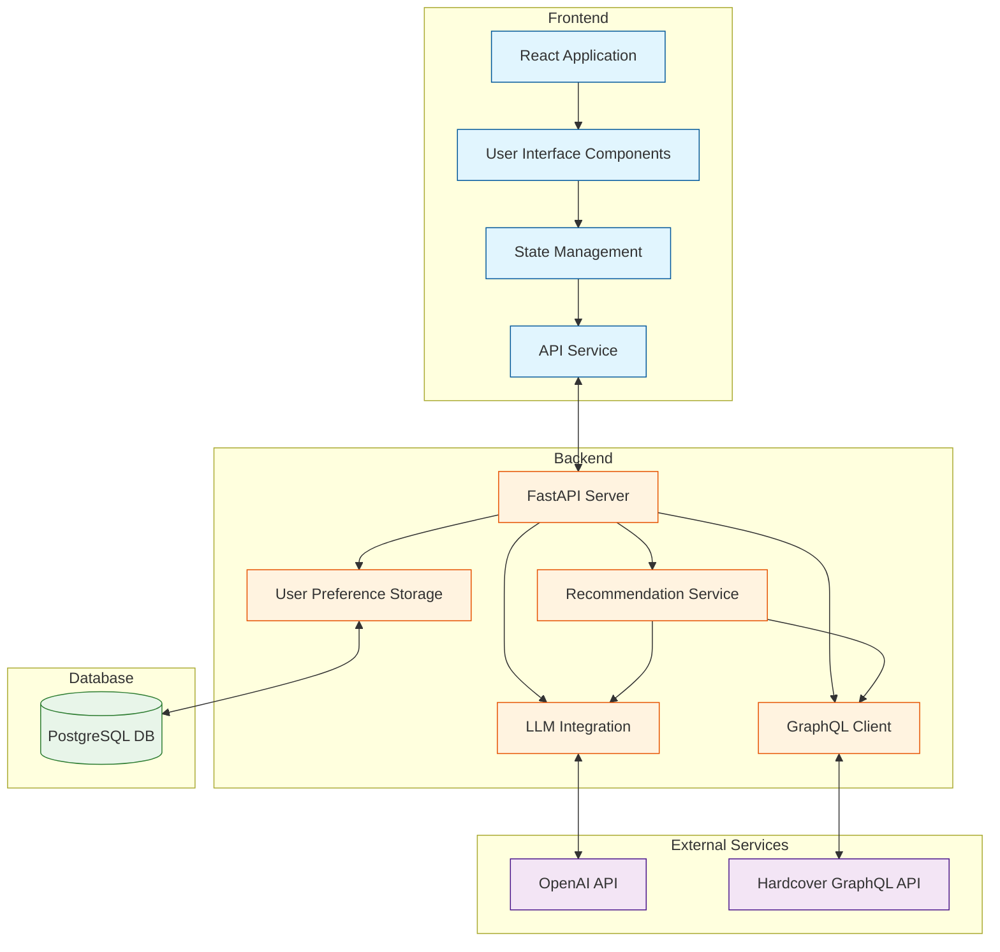

High level design (HLD)
---

1. System Overview\
The Book Recommendation System is a state-of-the-art web application that leverages AI-driven personalization to provide tailored book recommendations. It utilizes LangChain for AI orchestration, integrates with a GraphQL API for rich book data, and employs a microservices architecture for scalability and maintainability.

2. Key Components\

2.1 Frontend
- React-based single-page application
- Handles user interactions and displays recommendations

2.2 Backend

- FastAPI server with asynchronous request handling
- LangChain for LLM orchestration and prompt management
- GraphQL client (gql library) for external API communication
- SQLAlchemy ORM for database interactions

2.3 External Services

- OpenAI GPT-4 API: Powers the LLM-based recommendation engine
- Hardcover GraphQL API: Provides comprehensive book metadata

2.4 Database

- PostgreSQL with pgvector extension for vector similarity searches

3. User Scenarios\
3.1 New User Onboarding and Initial Recommendations

Flow:
- User completes a preference questionnaire on the React frontend.
- Frontend dispatches action to Redux store and sends POST request to /api/initial-recommendations.
- FastAPI backend receives the request and initializes a LangChain Sequential Chain.
- LangChain chain processes user preferences through the following steps:
- a. Preference Analysis: LLM analyzes user input to extract key preference features.
- b. Title Generation: Based on analysis, LLM generates a list of book titles.
- c. Metadata Retrieval: GraphQL client fetches book details from Hardcover API.
- d. Ranking and Filtering: LLM ranks books based on relevance and user preferences.\
- Backend returns top 20 recommendations to frontend.
- React components render the recommendations using server-side data fetching with Next.js.

3.2 Returning User - Home Screen Recommendations\
Flow:
- User logs into their account.
- Frontend requests personalized recommendations from the backend.
- Backend retrieves user preferences from the database.
- Backend generates new recommendations using LLM and user preferences.
- Backend fetches book details from Hardcover GraphQL API.
- Backend sends recommendations to the frontend.
- Frontend displays personalized recommendations on the home screen.

3.3 AI-Powered Chatbot Interaction\
Flow:

- User initiates chat through WebSocket connection.
- Backend establishes a LangChain ConversationChain with a memory buffer.
- User queries are processed through the following LangChain components:
-ConversationSummaryMemory for maintaining context
- OpenAIFunctionsAgent for understanding user intent
- Custom tools for book search, recommendation generation, and metadata retrieval\
- Chatbot responses are streamed back to the frontend using Server-Sent Events (SSE).
React components dynamically update to display chatbot responses and book recommendations.